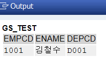
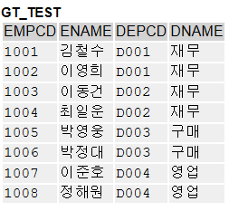
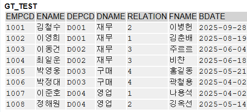

# 📚 Today I Learned
### 1. 직원 목록에서 직원 1명에 대한 여러 컬럼 정보 출력하기
```
*&---------------------------------------------------------------------*  
*& Report Z01_02  
*&---------------------------------------------------------------------*  
*&직원 목록에서 직원 1명에 대한 여러 컬럼 정보 출력하기  
*&---------------------------------------------------------------------*  
REPORT Z01_02.  
  
TYPES: BEGIN OF ts_test,  
        empcd TYPE zemplist-empcd,  
        ename TYPE zemplist-ename,  
        depcd TYPE zemplist-depcd,  
  END OF ts_test.  
  
DATA gs_test TYPE ts_test.  
  
  
SELECT SINGLE empcd, ename, depcd  
  FROM zemplist  
  WHERE empcd = '1001'  
  INTO @gs_test.  
  
cl_demo_output=>display( gs_test ).  
  
WRITE: gs_test.
```

#### 결과


---
### 2. 
```
*&---------------------------------------------------------------------*  
*& Report Z01_03  
*&---------------------------------------------------------------------*  
*&직원 목록에서 여러 직원을 출력하기  
*&---------------------------------------------------------------------*  
REPORT Z01_03.  
  
TYPES: BEGIN OF ts_test,  
        empcd TYPE zemplist-empcd,  
        ename TYPE zemplist-ename,  
        depcd TYPE zemplist-depcd,  
  END OF ts_test.  
  
DATA gt_test TYPE TABLE OF ts_test.  
  
TABLES: zemplist.  
SELECT-OPTIONS s_empcd  
FOR zemplist-empcd.  
  
SELECT empcd, ename, depcd  
  FROM zemplist  
  WHERE empcd IN @s_empcd  
  INTO TABLE @gt_test.  
  
cl_demo_output=>display( gt_test ).
```

#### 결과


---
### 3. 직원이 소속된 부서 정보를 가져오기
```
*&---------------------------------------------------------------------*  
*& Report Z01_04  
*&---------------------------------------------------------------------*  
*&직원이 소속된 부서 정보를 가져오기  
*&---------------------------------------------------------------------*  
REPORT Z01_04.  
  
TYPES: BEGIN OF ts_test,  
        empcd TYPE zemplist-empcd,  
        ename TYPE zemplist-ename,  
        depcd TYPE zemplist-depcd,  
        dname TYPE zteamlist-dname,  
  END OF ts_test.  
  
DATA gt_test TYPE TABLE OF ts_test.  
  
TABLES: zemplist.  
SELECT-OPTIONS s_empcd  
FOR zemplist-empcd.  
  
SELECT a~empcd, a~ename, a~depcd, b~dname  
  FROM zemplist AS a  
  INNER JOIN zteamlist AS b  
    ON b~depcd EQ a~depcd  
  WHERE empcd IN @s_empcd  
  INTO TABLE @gt_test.  
  
cl_demo_output=>display( gt_test ).
```

#### 결과


---
### 4. 직원 가족 정보 가져오기
```
*&---------------------------------------------------------------------*  
*& Report Z01_05  
*&---------------------------------------------------------------------*  
*&직원 가족정보 가져오기  
*&---------------------------------------------------------------------*  
REPORT Z01_05.  
  
TYPES: BEGIN OF ts_test,  
        empcd TYPE zemplist-empcd,  
        ename TYPE zemplist-ename,  
        depcd TYPE zemplist-depcd,  
        dname TYPE zteamlist-dname,  
        relation TYPE zfamily-relation,  
        fname TYPE zfamily-fname,  
        bdate TYPE zfamily-bdate,  
  END OF ts_test.  
  
DATA gt_test TYPE TABLE OF ts_test.  
  
TABLES: zemplist.  
SELECT-OPTIONS s_empcd  
FOR zemplist-empcd.  
  
SELECT a~empcd, a~ename, a~depcd, b~dname,  
   c~relation, c~fname, c~bdate  
  FROM zemplist AS a  
  INNER JOIN zteamlist AS b  
    ON b~depcd EQ a~depcd  
  LEFT JOIN zfamily AS c  
    ON c~empcd EQ a~empcd  
  WHERE a~empcd IN @s_empcd  
  INTO TABLE @gt_test.  
  
cl_demo_output=>display( gt_test ).
```


#### 결과

