# 1. 테이블 만들고 외래키 지정해서 연결하기
## 1. 테이블 만들기

### 1. 가족관계 테이블 만들기 ZFAMILY
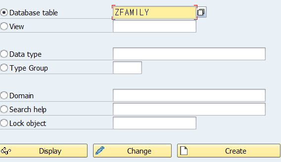

ZFAMILY로 테이블명을 지정해 주었다.

테이블 네이밍 룰: ZFAMILY [CBO 오브젝트(Z) + 오브젝트 내용(FAMILY)]

### 2. 테이블 설명 및 CBO 기본설정
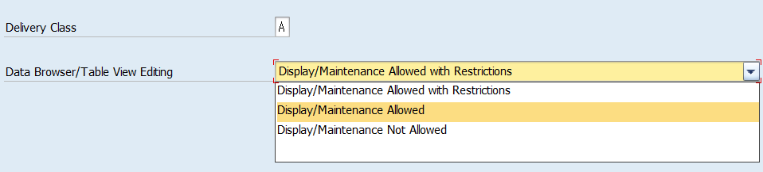
Delivery Class에서 A(application table)선택을 하고,

테이블 뷰 에디팅을 **Maintenance allowed**로 변경해준다.


그 이후 Extrgs 에서 Enhancement Category를 선택해준 후 


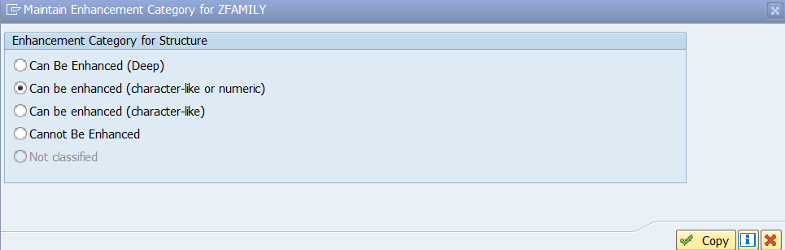

character-like or numeric을 선택하여 CHAR과 NUM 필드에 Append, Include 사용이 가능하게 해준다.


### 3. 필드값 작성해주기
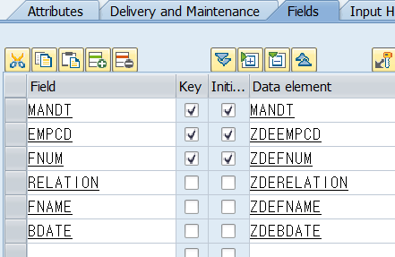
데이터 엘리먼트 네이밍 룰: CBO 오브젝트(Z) + 데이터 엘리먼트(DE) + 내용(EMPCD)


도메인 ZDRELATION 작성해준 후 더블클릭으로 도메인을 생성해준다.


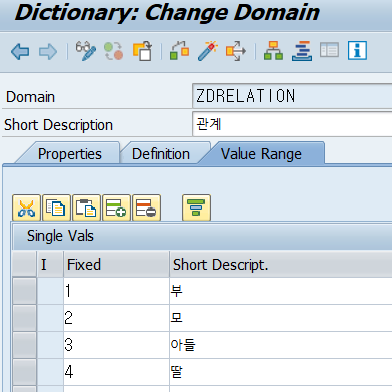

데이터 타입을 작성해주고, Value Range 고정 값 설정을 각각 해준다.

관계 필드의 Fixed(고정 값)은 해당 도메인에 입력할 수 있는 값을 제한하는 역할을 한다.

작성 후 ctrl+f3 으로 활성화 시켜준다.

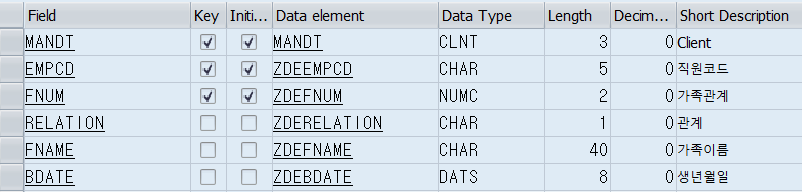
각각 도메인 값에
ZDEFNUM : NUMC2,
ZDEFNAME : TEXT40,
ZDEBDATE : DATUM 를 넣어 주었다.

### 4. 외래키 설정
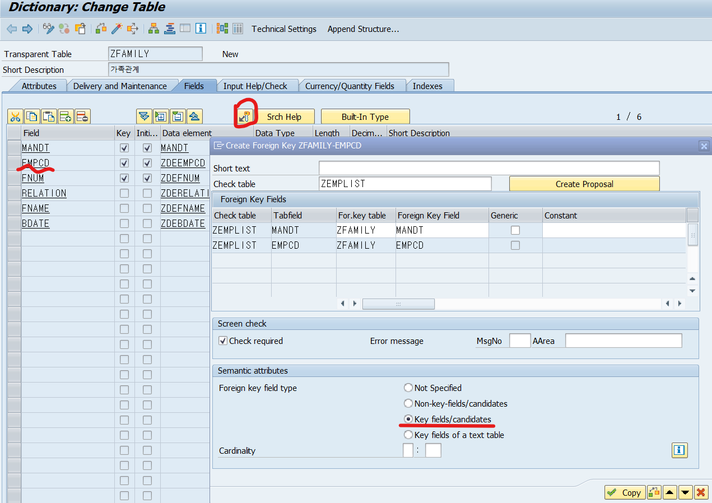
전에 ZEMPLIST 테이블을 작업해 두었었는데 그곳에 사번과 동일한 ZDEMPCD 도메인을 사용하기 때문에 EMPCD 필드에 외래키를 설정한다.

그 후 ZFAMILY 테이블을 활성화 해준다.

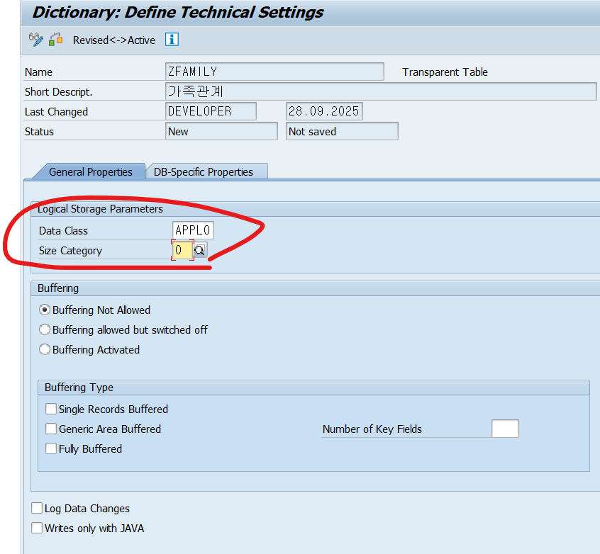
기술적 설정을 마저 작업해준다. DATA CLASS는 'APPL0', SIZE CATEGORY는 '0'을 입력하고 저장한다. 

ZFAMILY 테이블이 완성되었다.


---
# 2. 테이블 데이터 생성하기
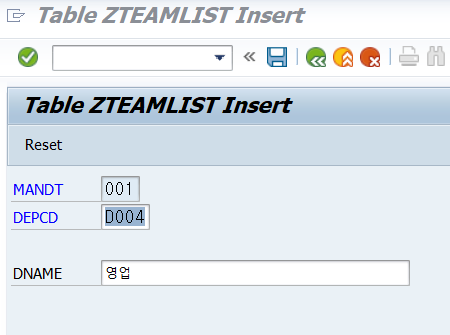
- `SE11` 실행 → 테이블`ZTEAMLIST`입력 → **Display**
- 상단 메뉴 → **Utilities → Table Contents → Create Entries**

원래는 SE16N을 입력해서 실행 후 데이터를 생성하려고 했으나 교육용이라 접속이 SE16N이 없었다. 그래서 SE11에서 작업을 해주었다.


ZTEAMLIST, ZEMPLIST, ZFAMILY 이렇게 총 3개의 테이블을 만들어 줬고, 데이터를 각각 삽입해 주었다.


---
# ⌨️ 리포트 실습
### 1. 직원 목록에서 직원 1명의 이름을 화면에 출력하기
```
REPORT Z01_01.  
  
DATA gv_ename TYPE zemplist-ename.  
  
SELECT SINGLE ename FROM zemplist  
  WHERE empcd EQ '1001'  
  INTO @gv_ename.  
  
  WRITE gv_ename.
```

#### 결과
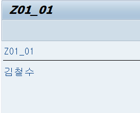


---
### 2. 파라미터 명령어로 사번 입력받아 출력하기
```
REPORT Z01_01.  
  
DATA gv_ename TYPE zemplist-ename.  
PARAMETERS: p_empcd TYPE zemplist-empcd.  
  
SELECT SINGLE ename  
  FROM zemplist  
  WHERE empcd = @p_empcd  
  INTO @gv_ename.  
  
  
WRITE: gv_ename.
```

#### 결과
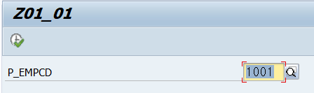
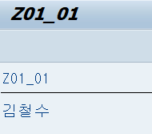


---
### 3 직원 목록에서 직원 1명에 대한 여러 컬럼 정보 출력하기
```
*&---------------------------------------------------------------------*  
*& Report Z01_02  
*&---------------------------------------------------------------------*  
*&직원 목록에서 직원 1명에 대한 여러 컬럼 정보 출력하기  
*&---------------------------------------------------------------------*  
REPORT Z01_02.  
  
TYPES: BEGIN OF ts_test,  
        empcd TYPE zemplist-empcd,  
        ename TYPE zemplist-ename,  
        depcd TYPE zemplist-depcd,  
  END OF ts_test.  
  
DATA gs_test TYPE ts_test.  
  
  
SELECT SINGLE empcd, ename, depcd  
  FROM zemplist  
  WHERE empcd = '1001'  
  INTO @gs_test.  
  
cl_demo_output=>display( gs_test ).  
  
WRITE: gs_test.
```

#### 결과


---
### 4. 직원 목록에서 여러 직원 출력하기 
```
*&---------------------------------------------------------------------*  
*& Report Z01_03  
*&---------------------------------------------------------------------*  
*&직원 목록에서 여러 직원을 출력하기  
*&---------------------------------------------------------------------*  
REPORT Z01_03.  
  
TYPES: BEGIN OF ts_test,  
        empcd TYPE zemplist-empcd,  
        ename TYPE zemplist-ename,  
        depcd TYPE zemplist-depcd,  
  END OF ts_test.  
  
DATA gt_test TYPE TABLE OF ts_test.  
  
TABLES: zemplist.  
SELECT-OPTIONS s_empcd  
FOR zemplist-empcd.  
  
SELECT empcd, ename, depcd  
  FROM zemplist  
  WHERE empcd IN @s_empcd  
  INTO TABLE @gt_test.  
  
cl_demo_output=>display( gt_test ).
```

#### 결과
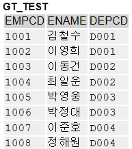

---
### 5. 직원이 소속된 부서 정보를 가져오기
```
*&---------------------------------------------------------------------*  
*& Report Z01_04  
*&---------------------------------------------------------------------*  
*&직원이 소속된 부서 정보를 가져오기  
*&---------------------------------------------------------------------*  
REPORT Z01_04.  
  
TYPES: BEGIN OF ts_test,  
        empcd TYPE zemplist-empcd,  
        ename TYPE zemplist-ename,  
        depcd TYPE zemplist-depcd,  
        dname TYPE zteamlist-dname,  
  END OF ts_test.  
  
DATA gt_test TYPE TABLE OF ts_test.  
  
TABLES: zemplist.  
SELECT-OPTIONS s_empcd  
FOR zemplist-empcd.  
  
SELECT a~empcd, a~ename, a~depcd, b~dname  
  FROM zemplist AS a  
  INNER JOIN zteamlist AS b  
    ON b~depcd EQ a~depcd  
  WHERE empcd IN @s_empcd  
  INTO TABLE @gt_test.  
  
cl_demo_output=>display( gt_test ).
```

#### 결과


---
### 6. 직원 가족 정보 가져오기
```
*&---------------------------------------------------------------------*  
*& Report Z01_05  
*&---------------------------------------------------------------------*  
*&직원 가족정보 가져오기  
*&---------------------------------------------------------------------*  
REPORT Z01_05.  
  
TYPES: BEGIN OF ts_test,  
        empcd TYPE zemplist-empcd,  
        ename TYPE zemplist-ename,  
        depcd TYPE zemplist-depcd,  
        dname TYPE zteamlist-dname,  
        relation TYPE zfamily-relation,  
        fname TYPE zfamily-fname,  
        bdate TYPE zfamily-bdate,  
  END OF ts_test.  
  
DATA gt_test TYPE TABLE OF ts_test.  
  
TABLES: zemplist.  
SELECT-OPTIONS s_empcd  
FOR zemplist-empcd.  
  
SELECT a~empcd, a~ename, a~depcd, b~dname,  
   c~relation, c~fname, c~bdate  
  FROM zemplist AS a  
  INNER JOIN zteamlist AS b  
    ON b~depcd EQ a~depcd  
  LEFT JOIN zfamily AS c  
    ON c~empcd EQ a~empcd  
  WHERE a~empcd IN @s_empcd  
  INTO TABLE @gt_test.  
  
cl_demo_output=>display( gt_test ).
```


#### 결과

