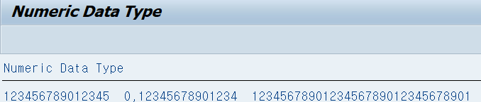

# 변수 선언
```
REPORT Z02_01.  
  
TYPEs t_var TYPE c LENGTH 20.  
DATA gv_var TYPE t_var.  
gv_var = 'Hellow ABAP'.  
WRITE: gv_var.
```


---
# 네이밍 룰 점검


---
#  Numeric Data Type

```
REPORT Z02_03.  
  
DATA gv_1 TYPE p.  
DATA gv_2 TYPE p DECIMALS 14.  
DATA gv_3 TYPE p LENGTH 16.  
  
gv_1 = ' 123456789012345 '.  
gv_2 = '0.12345678901234'.  
gv_3 = '1234567890123456789012345678901'.  
  
Write: / gv_1, gv_2, gv_3.
```



---
# 산술 연산자
```
*&---------------------------------------------------------------------*  
*& Report Z02_04  
*&---------------------------------------------------------------------*  
*&  
*&---------------------------------------------------------------------*  
REPORT Z02_04.  
  
*4바이트 정수  
DATA: gv_int1 TYPE i VALUE 2,  
      gv_int2 TYPE i VALUE 3,  
      gv_iresult TYPE i.  
  
gv_iresult = gv_int1 + gv_int2.  
WRITE: / '1:', gv_iresult.  
*-----------------------------  
  
ADD 5 TO gv_iresult.  
WRITE: / '2:', gv_iresult.  
  
*-----------------------------  
*고정 소수점  
DATA: gv_pack1 TYPE p DECIMALS 2 VALUE '2.17'.  
DATA: gv_pack2 TYPE p DECIMALS 2 VALUE '5.43'.  
DATA: gv_presult TYPE p DECIMALS 2.  
  
gv_presult = gv_pack2 / gv_pack2.  
WRITE: / '3:', gv_presult.  
*-----------------------------  
  
MULTIPLY gv_presult by gv_pack2.  
WRITE: / '4:', gv_presult.  
  
*-----------------------------  
*이진 부동소수점  
DATA: gv_float1 TYPE f VALUE '1.337'.  
DATA: gv_float2 TYPE f VALUE '2.7'.  
DATA: gv_fresult TYPE f.  
DATA: gv_cresult TYPE c LENGTH 16.  
  
gv_fresult = gv_float2 * gv_float1.  
WRITE: / '5:', gv_fresult.  
  
*-----------------------------  
CALL FUNCTION 'FLTP_CHAR_CONVERSION'  
EXPORTING  
  DECIM = 2  
  INPUT = gv_fresult  
  IMPORTING  
    FLSTR = gv_cresult.  
  
WRITE: / '6:', gv_cresult.
```


---
